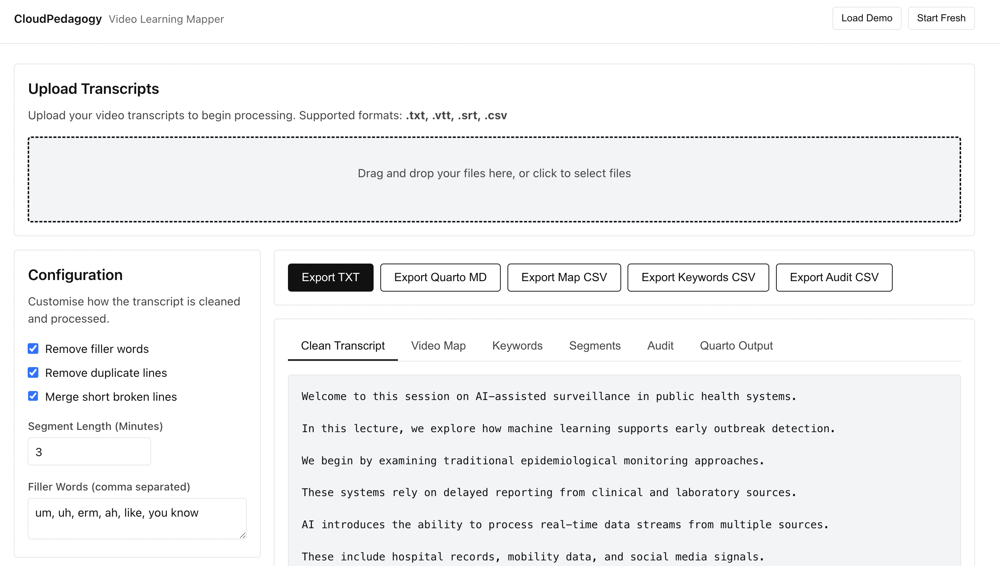

# CloudPedagogy Video Learning Mapper

## Overview
The CloudPedagogy Video Learning Mapper is a local-first, static web application that transforms unstructured video transcripts into structured, inspectable, and reusable learning content.

🌐 **Live Hosted Version**  
http://cloudpedagogy-video-learning-mapper.s3-website.eu-west-2.amazonaws.com/

🖼️ **Screenshot**  


This tool acts as a platform-agnostic processing layer, taking generic transcripts (from platforms like Panopto, Zoom, Teams, or YouTube) and automatically generating:
- Cleaned transcripts (timestamps and filler words removed)
- Timestamped Video Maps
- Keyword and Concept Frequency Analysis
- Video Segmentation Maps
- Quarto-compatible Learning Guides

## Why this tool matters
1. **Transforms video content into structured learning objects:** By parsing raw transcripts into time blocks and themes, educators can quickly reuse video content in text-based formats.
2. **Supports Capability and Governance:** Ensures all processing happens entirely within the browser, meaning no institutional data is sent to external APIs or LLMs. This guarantees full data privacy, accessibility compliance, and an audit trail for video content.

## Key Features
- **Transcript Cleaner:** Removes clutter, merges broken lines, and filters out common filler words.
- **Video Mapper:** Groups transcripts into readable time blocks (e.g. 3-minute chunks).
- **Keyword Extractor:** Rule-based extraction filtering out standard English stopwords.
- **Audit Tool:** Scans for missing timestamps, low word density, and excessively long unsegmented videos.
- **Quarto Generator:** Scaffolds a `.md` learning page with generic reflection prompts.

## How to run

1. **Install dependencies:**
   \`\`\`bash
   npm install
   \`\`\`

2. **Start the development server:**
   \`\`\`bash
   npm run dev
   \`\`\`

3. **Build for production:**
   \`\`\`bash
   npm run build
   \`\`\`

4. **Preview the production build:**
   \`\`\`bash
   npm run preview
   \`\`\`

## Deployment
Since this is a fully static Vite application with no backend or external API dependencies, the output of `npm run build` (`/dist` folder) can be hosted on any S3-compatible static hosting service, GitHub Pages, or Vercel.

---

## Demo Mode

This application includes a built-in demo to illustrate its functionality.

- Click **"Load Demo"** to restore a pre-populated example
- Click **"Start Fresh"** to clear all data

The demo includes a synthetic public health transcript in WebVTT format and example segmented learning mappings.

---

## Local Preview

To view the built application locally:

```bash
python3 -m http.server 8000 --directory dist
```

Then open:

http://localhost:8000

## Data Persistence

This application stores data locally in your browser using localStorage.

- No data is sent to any server
- Refreshing the page will retain your work
- Use "Start Fresh" to reset

---

## Capability and Governance

This tool supports both AI capability development and lightweight governance.

- Capability is developed through structured interaction with real workflows
- Governance is supported through optional fields that make assumptions, risks, and decisions visible

All governance inputs are optional and designed to support — not constrain — professional judgement.
